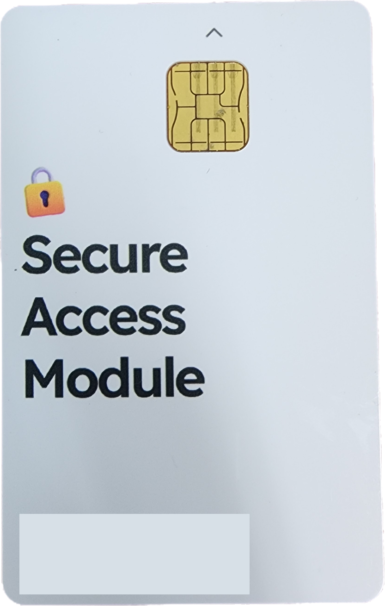
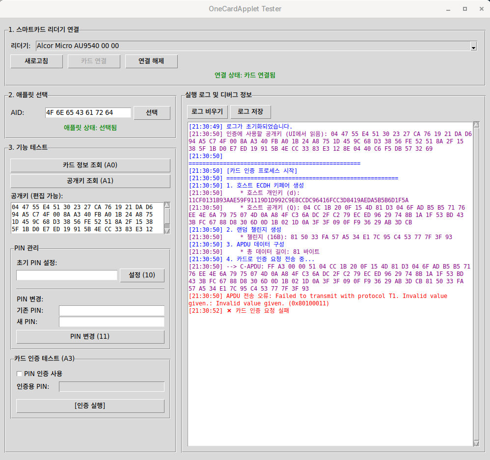

## OneCard Applet

OneCard Applet은 ECDH P-256 키 교환 알고리즘으로 유도된 AES-128 키를 사용하여 시도-응답 인증을 수행하는 오픈소스 Java Card 애플릿입니다. 

 관리자는 OneCard 애플릿을 [관리자 클라이언트](https://github.com/OneCard-OSS/OneCard-Admin-GUI)를 사용하여 호환되는 Java Card에 발급한 뒤 ID 카드 내부에서 생성되는 ECDH 공개키를 DB에 등록한 뒤 조직 구성원에게 배포할 수 있으며,

조직 구성원은 관리자의 접근 허용 범위에 따라 조직 내 온라인 서비스(OAuth 2.0) 또는 IoT 장치(출입문, PC 등)에 접근할 수 있습니다.

또한 OneCard 애플릿을 설치한 스마트카드는 PIN 기능을 제공하여 ID 카드의 도난에 따른 피해를 최소화 하고자 하였습니다.

PIN은 구성원이 처음 ID 카드를 발급받은 직후 OneCard 앱을 통해 지정하거나 변경할 수 있고, 추후 관리자가 고강도 인증을 사용하도록 지정한 일부 온라인 서비스에서 OneCard로 로그인할 때에 한하여 PIN을 요구받게 됩니다.

PIN 무차별 대입 공격에 대비하기 위하여 지정한 PIN 연속 시도 횟수(기본 6회)를 소진하면 스마트카드가 스스로 모든 인증 요청을 거부하며, 관리자 클라이언트를 통하여 애플릿을 재발급하기 전까지 해당 ID 카드는 사용할 수 없게 됩니다.

## Test Tool

OneCard 애플릿을 수정한 후 본 레포지터리의 [test-tool](https://github.com/OneCard-OSS/OneCard-ID-Card/tree/main/test-gui)을 활용하면 애플릿이 올바르게 인증 절차를 수행하는지 쉽게 시험해볼 수 있습니다.
